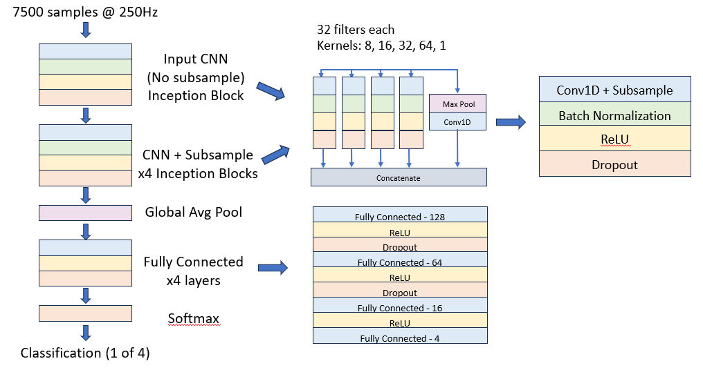
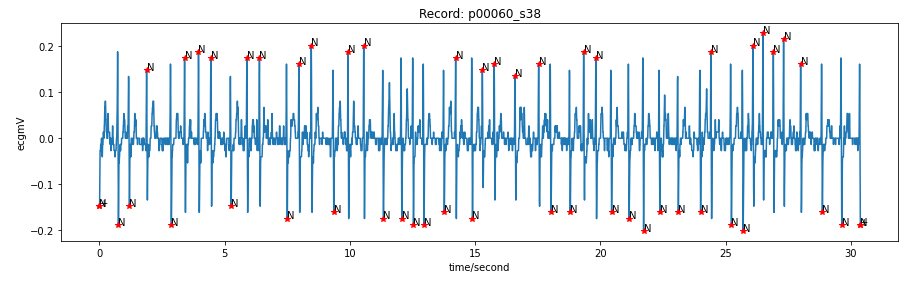
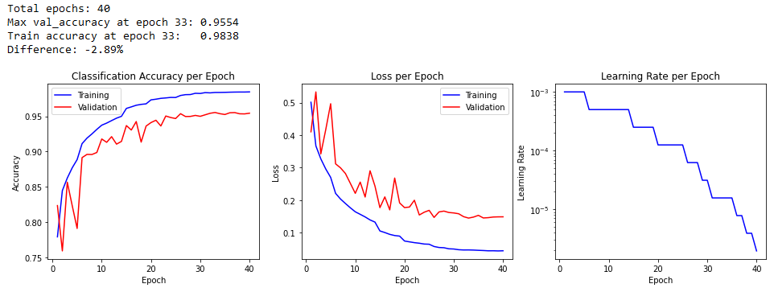
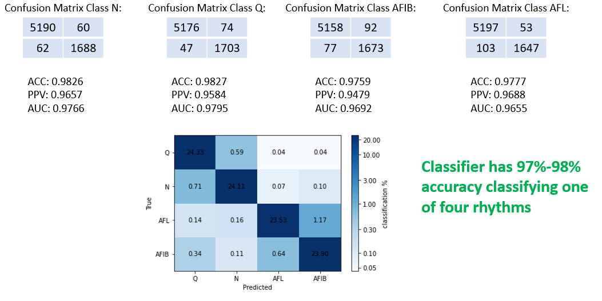
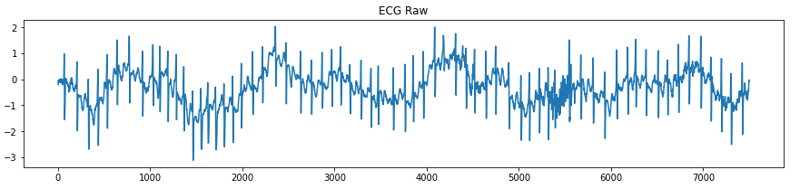
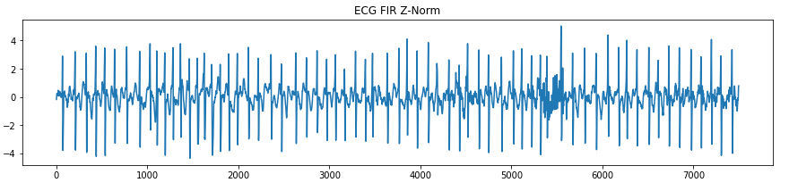
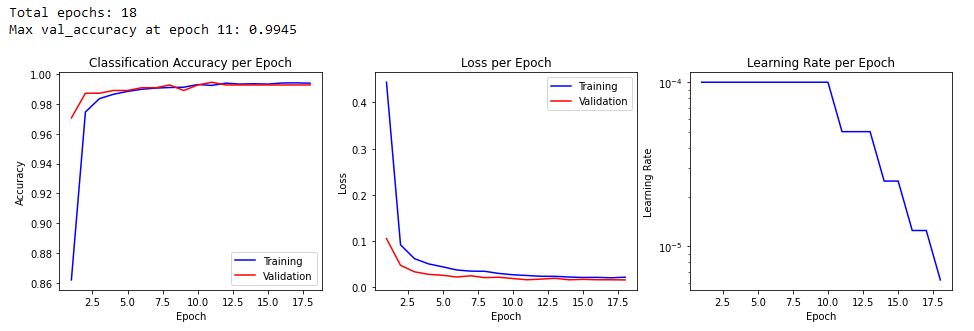
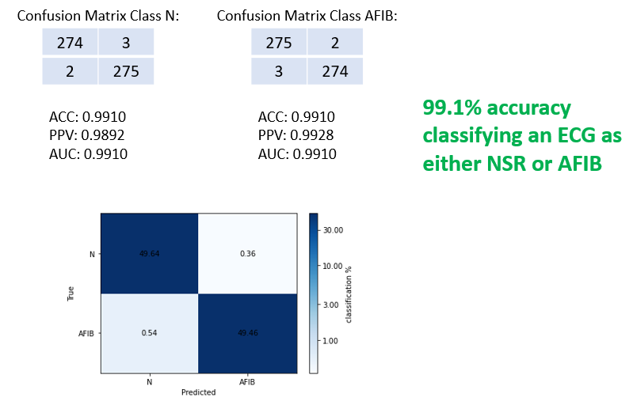

# Experimenting with Deep CNNs for Arrhythmia Detection in Embedded Systems

A personal research project to gain intuition into convolutional neural networks (CNNs) for time series data.  

(This repository is currently under construction - please check back for updates)

## 1. Introduction 

This project represents an experiment to determine the feasibility of using a deep convolutional network for detection and classification of time series data in an embedded system. There is a lot of information and research available regarding the use of deep CNNs for applications like natural language processing (NLP) and image classification.  However, there is much less research available regarding the use of CNNs for time series data, such as that produced by accelerometers, biometric sensors, environmental sensors and the like.  

In this project, I use publicly available electrocardiogram (ECG) data from PhysioNet to train a large arrhythmia classification model, convert the model to a form that can run on an embedded system, and test it with previously unseen data and measure its accuracy.  I also apply transfer learning techniques using a different, smaller ECG data set to simulate tailoring the model for a specific target device's sensor data.

I found that it is possible to detect atrial fibrillation (AFIB) with 99% accuracy in near real-time on a Raspberry Pi.

## 2. General Methodology
1. Design a deep CNN modeled after published examples
2. Train the network using a large dataset
3. Apply transfer learning techniques using a different, smaller dataset  
4. Benchmark model performance on a PC
5. Convert to a TensorFlow Lite model
6. Run on an embedded system and compare performance to the benchmark

## 3. Development Environment
The general development environment is Python and TensorFlow running in a Jupyter Notebook:
- Python 3.8 - 3.10 depending on the runtime environment  
- TensorFlow 2.10 – 2.12 depending on the runtime environment  

Training was performed on a cloud GPU virtual machine designed for deep learning.  
A python script was used to run the TensorFlow Lite model on a Raspberry Pi and gather results.  

## 4. The Deep CNN Model
The original inspiration for the deep CNN model was a project and paper from the Stanford ML Group [[3]](#ref-03) [[4]](#ref-04).  In this project, they trained a 34-layer CNN to detect arrhythmias in time series ECG.  Due to difficulties in reproducing the model for use with my dataset, I designed a different model based on a modified version of an InceptionNet classifier using parallel convolutions with different kernel sizes [[5]](#ref-05).  I also experimented with the InceptionTime architecture for time series data, but found it to be less accurate than the basic InceptionNet for my specific application [[6]](#ref-06). The model also employs a ResNet architecture using skip connections at each layer [[7]](#ref-07).

An overview of the CNN model is shown here:

  

The model consists of a series of inception blocks, followed by a global average pooling layer, followed by a series of fully connected layers, and a final softmax layer that provides one of four classification probabilities. 

The model contains a total of five convolution layers with a total of 25 convolution blocks and four fully connected layers with a total of 212 neurons.  There are a total of 2,515,284 parameters in the model.

A complete model graph can be found <a href="./images/InceptionNet-Model-Complete.png" target="_blank">here</a>.

### 4.1 Inception Block
Each inception block consists of four parallel 1D convolutions, each with different kernel sizes. A ReLU activation layer provides the non-linear processing step.  Batch normalization and dropout layers are used to make training of each sub-block faster and more stable, and help prevent overfitting [[8]](#ref-08) [[9]](#ref-09).  The architecture of the inception block was inspired by the Stanford ML Group model [[3]](#ref-03).  

The convolutions can be thought of as feature extractors that learn the import features of the ECG signals through the supervised training process.  The various kernel sizes allow the network to learn features over different time spans of the ECG signal. The deeper layers allow the network to learn features over different levels of the signal [[10]](#ref-10). 

#### 4.1.1 Skip Connection
In each inception block, a parallel max pool layer provides a skip connection to help with the problem of vanishing/exploding gradients [[7]](#ref-07).  In addition, the max pool layer is followed by a 1D convolution in order to match the number of filters (32) in the other convolutions. The outputs of each convolution are concatenated and fed to the next layer.

#### 4.1.2 Subsampling
In all but the first inception block, the 1D convolution is subsampled by a factor of two in the ECG sample dimension. This is accomplished by performing the convolution with a stride of 2. If the resulting dimension has an odd length, it is zero padded at the input to the next layer so that it can be evenly subsampled.

### 4.2 Global Average Pooling Layer
The transition from inception blocks to the fully connected classification layers is accomplished using global average pooling in the ECG sample dimension. This is consistent with published works using inception blocks [[5]](#ref-05) [[6]](#ref-06).

### 4.3 Fully Connected Layers
A sequence of four fully connected layers are used to perform the ECG signal classification.  They consist of 128, 64, 16, and 4 nodes respectively. The first three use ReLU activation, and the final layer uses softmax activation to provide classification into one of four signal classes.

## 5. The Large Dataset
I used the Icentia11k Single Lead Continuous Raw Electrocardiogram Dataset from PhysioNet to train the model [[1]](#ref-01). This is a dataset of continuous raw ECG signals containing 11 thousand patients and 2 billion labelled beats. Four types of heart rhythms are annotated:

| Label | Type |
| ----- | ---- |
| N | Normal Sinus Rhythm |
| Q | Unclassifiable Rhythm |
| AFIB | Atrial Fibrillation |
| AFL | Atrial Flutter |

I extracted an equal number of non-overlapping 30-second examples of each rhythm type for training.  Overall, 140,000 training examples were used.  Each example contained 7500 samples, and each example was normalized using a standard Z-score normalization so that each example had a mean of zero and a standard deviation of one.  Each example was one-hot encoded with its corresponding rhythm type. The traning example distribution is as follows:

- N = 35,000 examples from 10,251 patients
- Q = 35,000 examples from 20,835 patients
- AFIB = 35,000 examples from 725 patients
- AFL = 35,000  examples from 490 patients

Training/validation/test datasets were split 90%/5%/5% (126K/7K/7K) respectively.

An example of a 30-second annotated normal sinus rhythm example is shown here:  

 

## 6. Large Dataset Training and Test Results
Training was performed on using a batch size of 125. The convolution kernels were initialized using "HeNormal" initialization, which was inspired by the Stanford ML Group paper [[4]](#ref-04).  The Adam optimizer was used, and the learning rate was cut in half if no improvement was achieved after 2 epochs. Training was optimized to maximize validation accuracy.  Early stopping was employed to halt training if no improvement is achieved after 7 epochs. Training history graphs are shown here:

 

Some interesting observations are noted:
1. Training early stopped after only 40 epochs. Most deep CNNs in the literature would train for hundreds or even thousands of epochs.
2. The wild validation accuracy variation in the first few epochs probably indicates that the initial learning rate was too high.
3. The fact that validation accuracy never catches up to training accuracy indicates that overfitting is occurring. This was surprising to me since such a large dataset is being used.

If this model was intended for use in production, then some hyperparameter tuning would be performed to try to improve training results.  However, even with this initial pass, good classification results were obtained as shown by the following confusion matrices:

When trained with the large dataset, the model achieved 97%-98% accuracy classifying one of four rhythms.

## 7. Transfer Learning

### 7.1 Dataset
For a deep CNN model to be useful on an embedded system, it must be trained on the target system's sensor data.  This is achieved through the use of transfer learning.  To simulate this, I used the much smaller MIT-BIH Atrial Fibrillation Database to mimic sensor data from a target embedded system. This database contains 25 long-term ECG recordings of patients with AFIB [[2]](#ref-02). 

The total number of non-overlapping 30-second examples of each rhythm type in the MIT-BIH dataset classified by the deep CNN model were found to be as follows:

| Label | Type | # 30-Second Examples |
| ----- | ---- | ----- |
| N | Normal Sinus Rhythm | 16,554 |
| Q | Unclassifiable Rhythm | 0 |
| AFIB | Atrial Fibrillation | 11,064 |
| AFL | Atrial Flutter | 190 |

Due to the lack of Q and AFL examples, only N and AFIB examples were used for transfer learning.  A dataset was constructed using the following distribution:
- N = 5,532 examples from 21 patients
- AFIB = 5,532 examples from 23 patients

Note: Due to a programming error, only half of the available data was used.  This is why only 5,532 examples of each type were used instead of 11,064 examples of each type.

Training/validation/test datasets were split 90%/5%/5% (9,956/554/554) respectively.

An example 30-second ECG waveform from this dataset is shown here:

 

Due to the baseline wander, a FIR bandpass filter was applied to all examples that attenuated all frequencies below 0.5 Hz and above 49 Hz.  This removes any baseline wander as well as 50Hz/60Hz noise.  The same ECG waveform after filtering and Z-score normalization is shown here:

 

The FIR filter contains 741 taps. If it is used on a real-time ECG signal sampled at 250Hz, it would delay the signal by approximately 3 seconds.

### 7.2 Deep CNN model modifications
The deep CNN model was modified for transfer learning as follows:
1. The last 4-node fully connected layer was removed and replaced with a 2-node layer since only two rhythm classes are now possible.
2. The previously trained parameters were loaded into the model.
3. All inception net layer parameters were made non-trainiable, and all fully connected layer parameters were allowed to be trained.

This resulted in 29,938 trainable parameters and 2,515,250 fixed (non-trainable) parameters.

### 7.3 Training
Training was performed using a batch size of 32.  The Adam optimizer was used again, although the initial learning rate was set an order of magnitude lower than the Icentia11k training run.  The same learning rate reduction and early stopping callbacks were applied.  Training history graphs are shown here:

 

Again, training early stopped after only 18 epochs.  However, validation accuracy was within 0.2% of training accuracy, so no overfitting seemed to occur. 

### 7.4 Transfer Learning Test Results
Results using the previously unseen test data set provided the following result:

The deep CNN model had 99.1% accuracy classifying a simulated target sensor ECG signal as either N or AFIB.

## 8. Conversion to TensorFlow Lite
In order to run on an embedded system, the deep CNN model must be converted to a form suitable for the target device.  This was accomplished using TensorFlow Lite, a library and toolset used for converting and deploying models on mobile devices, microcontrollers and other devices with limited memory or computational power [[11]](#ref-11).

The trained deep CNN model was converted into two different python-compatible TensorFlow Lite models for comparison:
- A non-optimized model using 32-bit floating point arithmetic
- A size-optimized model using 16-bit floating point arithmetic

## 9. Raspberry Pi Results
Each TensorFlow Lite deep CNN model was run on a Raspberry Pi 4 using the same test data set as in Section 7.4, and the following results were obtained:

|     | Size | Math | Speed | Accuracy |
| --- | ---- | ---- | ----- | -------- |
| HP Laptop | 10.5 MB | F64 | 0.150s | 99.1% |
| RPi4 - TFLite | 10.1 MB | F32 | 1.000s | 99.1% |
| RPi4 - TFLite Optimized | 2.6 MB | F16 | 0.733s | 99.1% |

In particular:  
- **There is no loss in accuracy when a size-optimized model is run on a Raspberry Pi 4** 
- **The optimized model is 74% smaller and 27% faster than the non-optimized model**  

## 10. Conclusions
This research project showed that it is possible to run time-series predictions on a deep CNN model on an embedded system in near real-time with high accuracy.  The ECG pre-processing step of FIR filtering and Z-score normalization requires approximately 3 seconds, and the prediction step requires approximately 0.73 seconds.  In addition, accuracy on the embedded system is identical to the PC/workstation used to train and test the model.

The model size used in this project is not suitable for a "bare-metal" embedded system, but it could run on an embedded Linux processor or an Android or iOS mobile device such as a cell phone or a tablet.

Additional optimizations may be possible for a bare-metal system, such as developing custom C/C++ code and/or using fixed point arithmetic, but further investigation would be required.

## 11. References
[1] Icentia11k dataset: https://physionet.org/content/icentia11k-continuous-ecg/1.0   
[2] MIT-BIH AFIB dataset: https://physionet.org/content/afdb/1.0.0    
[3] Stanford ML Group website: https://stanfordmlgroup.github.io/projects/ecg    
[4] Rajpurkar, et. al. Cardiologist-Level Arrhythmia Detection with Convolutional Neural Networks https://arxiv.org/abs/1707.01836    
[5] Szegedy, et. al. Going Deeper with Convolutions https://arxiv.org/abs/1409.4842    
[6] Fawaz, et. al. InceptionTime: Finding AlexNet for Time Series Classification https://arxiv.org/abs/1909.04939    
[7] He, et. al. Deep Residual Learning for Image Recognition https://arxiv.org/abs/1512.03385    
[8] Ioffe, et. al. Batch Normalization: Accelerating Deep Network Training by Reducing Internal Covariate Shift https://arxiv.org/abs/1502.03167   
[9] Srivastava, et. al. Dropout: A Simple Way to Prevent Neural Networks from Overfitting https://jmlr.org/papers/v15/srivastava14a.html    
[10] Jogin, et. al. Feature Extraction using Convolution Neural Networks (CNN) and Deep Learning https://ieeexplore.ieee.org/abstract/document/9012507    
[11] TensorFlow Lite website: https://www.tensorflow.org/lite   

